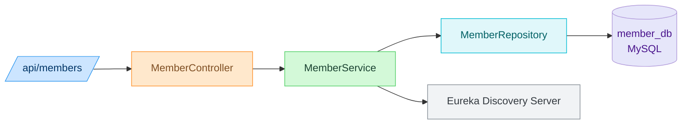
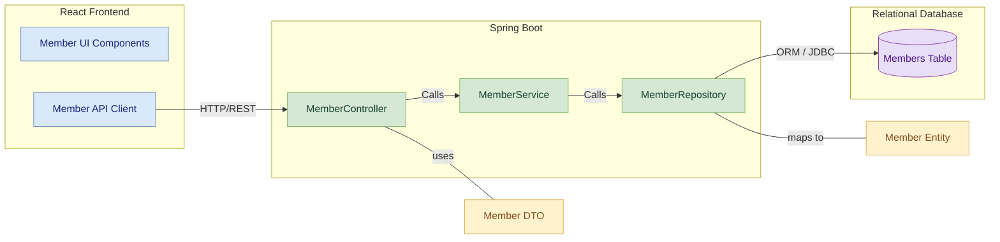
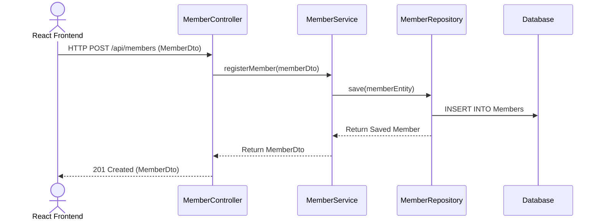

#  Member Service

## 📚 Table of Contents
- [Overview](#overview)
- [Features](#features)
- [Folder Structure](#folder-structure)
- [REST API Endpoints](#rest-api-endpoints)
- [Data Model](#data-model)
- [Module Architecture Diagram](#module-architecture-diagram)
- [Component Diagram](#component-diagram)
- [Sequence Diagram](#sequence-diagram)
- [Run Locally](#run-locally)

## Overview
- The Member Management Service is a standalone Spring Boot microservice responsible for handling member registration, profile updates, and managing the membership lifecycle in a Library Management System. It is designed for modularity, scalability, and integration within a microservices ecosystem via Eureka Discovery and Spring Cloud Gateway.
---
##  Features

- Register new members
- Search members by name or status
- Retrieve member by ID or email
- Update member details and status
- Delete or deactivate accounts

---
## Folder Structure
<pre>
src/
└── main/
    ├── java/
    │   └── com.library.member/
    │       ├── controller/       # REST controllers
    │       ├── dto/              # Data Transfer Objects
    │       ├── entity/           # JPA Entities
    │       ├── repository/       # Spring Data Repositories
    │       └── service/          # Business logic layer
    └── resources/
        └── application.properties  # App configuration
</pre>
---

##  REST API Endpoints

| Method | Endpoint               | Description               |
|--------|------------------------|---------------------------|
| POST   | `/api/members`         | Register a new member     |
| PUT    | `/api/members/{id}`    | Update existing member    |
| GET    | `/api/members/{id}`    | Retrieve member by ID     |
| GET    | `/api/members?email=`  | Retrieve member by email  |

---

##  Data Model

### Member Entity

| Field             | Type     | Description                  |
|-------------------|----------|------------------------------|
| `memberId`        | BIGINT   | Primary key, auto-generated  |
| `name`            | VARCHAR  | Member's full name           |
| `email`           | VARCHAR  | Must be unique               |
| `phone`           | VARCHAR  |                              |
| `address`         | VARCHAR  |                              |
| `membershipStatus`| ENUM     | `ACTIVE` / `INACTIVE`        |
| `registrationDate`| DATE     | Member's onboarding date     |

---
##  Module Architecture Diagram 



_This diagram illustrates the layered architecture:_

- API Gateway routes requests
- MemberController handles HTTP requests
- Business logic sits in MemberService
- Data access is handled by MemberRepository
- Data is persisted to a MySQL database
- The service is registered with Eureka for discovery

## Component Diagram


## Sequence Diagram

---

- Swagger Url : http://localhost:8081/swagger-ui/index.html#/
- Eureka Discovery : http://localhost:8761/

---
##  Run Locally

```bash
# Clone this repo

# Navigate to the folder
cd member-service

# Build and run
mvn clean install
mvn spring-boot:run
