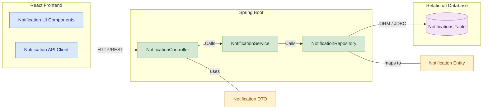
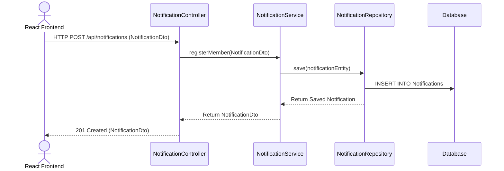

#  Notification Service

## 📚 Table of Contents
- [Overview](#overview)
- [Features](#features)
- [Folder Structure](#folder-structure)
- [REST API Endpoints](#rest-api-endpoints)
- [Data Model](#data-model)
- [Module Architecture Diagram](#module-architecture-diagram)
- [Component Diagram](#component-diagram)
- [Sequence Diagram](#sequence-diagram)
- [Run Locally](#run-locally)
 
## Overview
-  The **Notification Service** delivers alerts and system messages to library members. It handles due date reminders, overdue notices, and fine notifications by email, SMS, or in-app delivery. This service is triggered by other modules like Borrowing and Fine and logs all sent messages for traceability.

---
##  Features

- Accept notification requests from other services
- Log and store notifications for each member
- Enable member-specific notification retrieval
- Future-proofed for email/SMS integrations
- Trigger alerts based on due dates, fines, and account status

---

## Folder Structure
<pre>
src/
└── main/
    ├── java/
    │   └── com.library.book/
    │       ├── controller/       # REST controllers
    │       ├── dto/              # Data Transfer Objects
    │       ├── entity/           # JPA Entities
    │       ├── repository/       # Spring Data Repositories
    │       └── service/          # Business logic layer
    └── resources/
        └── application.properties  # App configuration
</pre>
---
##  REST API Endpoints

| Method | Endpoint                          | Description                        |
|--------|-----------------------------------|------------------------------------|
| POST   | `/api/notifications/send`         | Send and log a new notification    |
| GET    | `/api/notifications/{memberId}`   | Fetch notifications for a member   |

Swagger URL : http://localhost:8080/swagger-ui/index.html#/

## Data Model

### `Notification` Entity

| Field           | Type      | Description                          |
|------------------|-----------|--------------------------------------|
| notificationId   | BIGINT    | Primary key                          |
| memberId         | BIGINT    | FK to `Member`                       |
| message          | TEXT      | Notification content                 |
| dateSent         | DATETIME  | Timestamp of delivery                |

---
## Component diagram
 

## Sequence Diagram

---

## Run Locally

```bash
# Clone this repo
# Navigate to the folder
cd member-service
# Build and run
mvn clean install
mvn spring-boot:run
