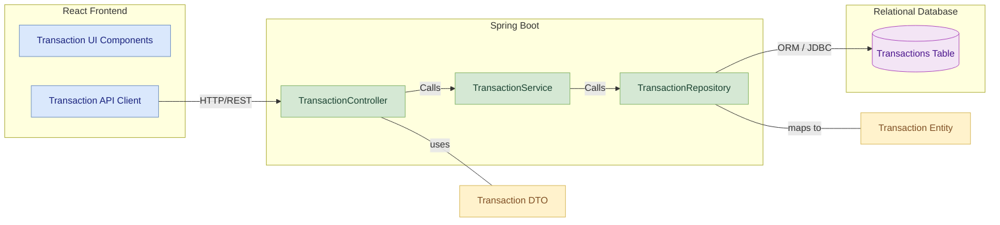
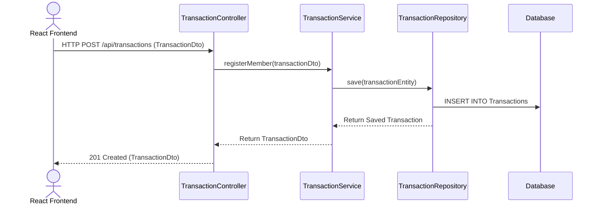

# Borrowing Service
 
## 📚 Table of Contents
- [Overview](#overview)
- [Features](#features)
- [Folder Structure](#folder-structure)
- [REST API Endpoints](#rest-api-endpoints)
- [Data Model](#data-model)
- [Module Architecture Diagram](#module-architecture-diagram)
- [Component Diagram](#component-diagram)
- [Sequence Diagram](#sequence-diagram)
- [Run Locally](#run-locally)

## Overview
-  The Borrowing Service is responsible for handling book loan and return operations in the Library Management System. It maintains borrowing history for each member, checks borrowing eligibility, and updates book availability. This service integrates with Book and Member services and registers with Eureka for service discovery.

## Features
- Borrow a book by a registered member
- Return a borrowed book
- Validate borrow limits or book availability
- View borrowing history by member
- Track active vs. returned borrow records


## Folder Structure
<pre>
src/
└── main/
    ├── java/
    │   └── com.library.book/
    │       ├── controller/       # REST controllers
    │       ├── dto/              # Data Transfer Objects
    │       ├── entity/           # JPA Entities
    │       ├── repository/       # Spring Data Repositories
    │       └── service/          # Business logic layer
    └── resources/
        └── application.properties  # App configuration
</pre>
---
## REST API Endpoints

| Method | Endpoint                           | Description                    |
|--------|------------------------------------|--------------------------------|
| POST   | `/api/borrowings`                  | Borrow a book                  |
| PUT    | `/api/borrowings/return/{id}`      | Return a book by transactionId |
| GET    | `/api/borrowings/member/{memberId}`| Get member borrow history      |


## Data Model

`BorrowingTransaction` Entity

| Field         | Type     | Description                           |
|---------------|----------|---------------------------------------|
| transactionId | BIGINT   | Primary key                           |
| memberId      | BIGINT   | Foreign key to Member                 |
| bookId        | BIGINT   | Foreign key to Book                   |
| borrowDate    | DATE     | Date when the book was borrowed       |
| dueDate       | DATE     | Due date for returning the book       |
| returnDate    | DATE     | Nullable; date of return              |
| status        | VARCHAR  | BORROWED / RETURNED                   |

## Inter-Service Communication

This service may call:
- **Member Service**: to confirm member is ACTIVE
- **Book Service**: to confirm and update available copies
## Component diagram
 

## Sequence Diagram

---
##  Layered Architecture per Microservice
Each service follows a standard 3-layered architecture pattern to ensure clean separation of concerns and long-term scalability:

**Controller Layer**  
  `BorrowingController`: Exposes endpoints for issuing and returning books  
  → `/api/borrow`, `/api/return`

- **Service Layer**  
  `BorrowingService`, `BorrowingServiceImpl`: Manages due dates, availability checks, and triggers fine calculation

- **Repository Layer**  
  `BorrowingRepository`: Tracks all borrow/return records per member and book
---

##  Run Locally
```bash
# Clone this repo
# Navigate to the folder
cd member-service
# Build and run
mvn clean install
mvn spring-boot:run

